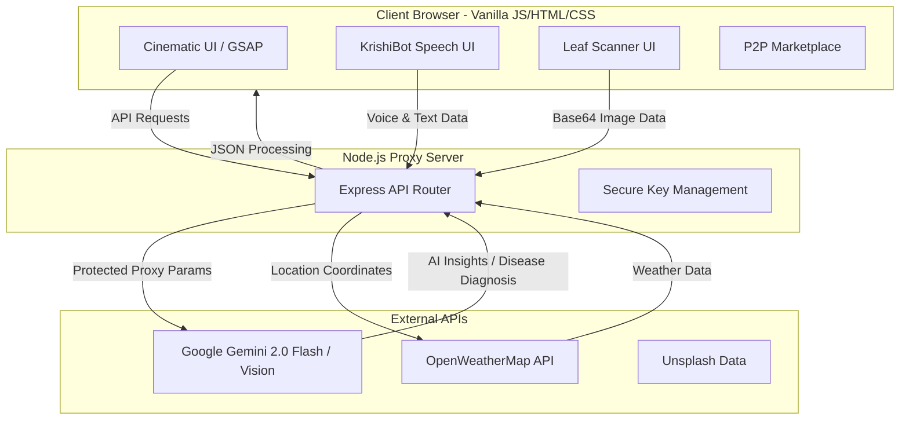

# 🌾 BharatFarm — The Future of Indian Agriculture


<div align="center">
  
  
  
  
</div>

<br/>

> **BharatFarm** is a visionary agricultural ecosystem designed to bridge the digital divide in rural India. By combining **Generative AI**, **Computer Vision**, and **Cinematic Web UX**, we provide farmers with a "digital companion" that speaks their language and secures their livelihood.

---

## 🚨 The Problem vs 💡 The Solution

| Current Agricultural Challenges | The BharatFarm Solution |
| :--- | :--- |
| **Information Gap:** Farmers lack real-time access to expert agricultural advice in their native languages. | **KrishiBot AI:** A 24/7 multilingual voice assistant providing instant contextual guidance. |
| **Crop Diseases:** Delayed diagnosis leads to massive yield losses and excessive pesticide use. | **Gemini Vision Scanner:** Instant, highly accurate leaf disease detection from a single smartphone photo. |
| **Middle-men Exploitation:** Farmers are forced to sell produce at low margins to intermediaries. | **Direct Agri-Marketplace:** A zero-commission P2P platform connecting farmers directly to buyers. |

---

## 🚀 Core Innovations

### 1. 🤖 Intelligent AI Ecosystem
- **🎙️ KrishiBot Assistant:** A real-time AI companion utilizing **Speech-to-Text (STT)** and **Text-to-Speech (TTS)**. Farmers can *talk* to their application and get expert advice back via voice.
- **🍃 AI Leaf Scanner:** Powered by **Google Gemini Vision**, our scanner diagnoses plant diseases with human-like precision, recommending exact fertilizers and treatments instantly.

### 2. 📊 Precision Analytics
- **🌤️ Smart Weather:** Localized weather data with proximity-based safety alerts for farming operations (e.g., stopping pesticide spray before rain).
- **💰 Financial Suite:** Professional cost and revenue calculators supporting local Indian land measurement units (**Acre, Bigha, Katha**).
- **🗺️ Activity Roadmap:** AI-generated day-by-day schedules tailored specifically to the selected crop's lifecycle.

### 3. 🎬 Cinematic User Experience
- **GSAP Frame Sequencing:** We abandoned boring SaaS templates for a high-performance **GSAP ScrollTrigger** animation sequence of **240 high-resolution frames** to guide users through an immersive, storytelling landing page.
- **Responsive Glassmorphism:** A premium, modern interface that scales perfectly from a 4K monitor down to a budget smartphone.

---

## 🏗️ System Architecture



---

## 🌍 Impact Metrics

By adopting the BharatFarm ecosystem, a typical rural farming community can expect:
- **⬆️ 15-20% Increase in Profit Margins:** Achieved through direct-to-consumer trade and precise cost calculations.
- **⬇️ 30% Reduction in Chemical Waste:** Driven by exact, AI-recommended fertilizer dosages instead of blind application.
- **⏱️ 24/7 Expert Accessibility:** Democratizing agricultural knowledge without requiring literacy, thanks to voice integrations.

---

## 🛠️ Quick Start

### Prerequisites
- [Node.js](https://nodejs.org/) (v16+)
- [NPM](https://www.npmjs.com/) (latest)

### Installation

1. **Clone the Repository**
   ```bash
   git clone https://github.com/Souvik-Dey-2029/BharatFarm_Final-Version.git
   cd BharatFarm_Final-Version
   ```

2. **Install Dependencies**
   ```bash
   npm install
   ```

3. **Configure Environment**
   Create a `.env` file in the root directory:
   ```env
   OPENROUTER_API_KEY=your_gemini_api_key_here
   ```

4. **Launch the Server**
   ```bash
   node server.js
   ```
   *Visit `http://localhost:5000` to experience the application.*

---

## 👥 Meet the Architects

| Developer | Role | Profile |
| :--- | :--- | :--- |
| **Souvik Dey** | Lead Developer,Backend & Front End/Web Designer & Problem Statement Originator | [](https://www.linkedin.com/in/souvik-dey-400497366/) |
| **Partha Sarathi Sarkar**| Full Stack & GenAI Prompt Engineer | [](https://www.linkedin.com/in/partha-sarathi-sarkar-7385a8367/) |
| **Samrat Chatterjee** | AI Integration Architect | [](https://www.linkedin.com/in/samrat-chatterjee-2aa543368/) |
| **Snehasis Chakroborty**| UI/UX Motion Designer & Prompt Engineer | [](https://www.linkedin.com/in/snehasis-chakraborty-2b68823a6/) |

---

<div align="center">
  <p><i>Demonstration project engineered for agricultural empowerment. Built with passion for a Digital India.</i> 🇮🇳</p>
  <p>&copy; 2026 BharatFarm. All Rights Reserved.</p>
</div>
